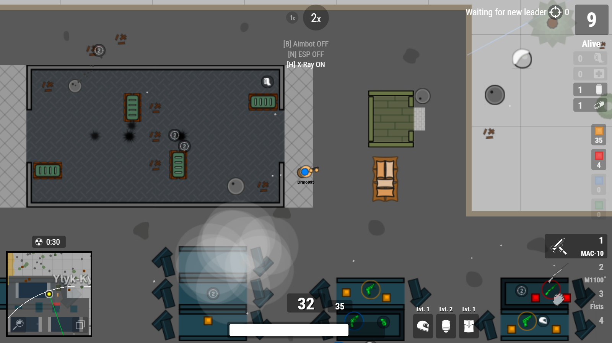

# Survev-Krityhack 🎯

**Survev-Krityhack** is a cheat tool designed to enhance gameplay in the game survev.io by providing various hacks and modifications.

## Features ✨
- 🏠 **X-Ray (No Ceilings)**: Removes ceilings from buildings, allowing you to see inside.
- 🖱️ **Improved mouse click functionality**: You will be able to hold down the left mouse button continuously, reducing the need for multiple clicks to shoot.
- 🔍 **Enhanced game zoom**.
- 🌫️ **Smoke opacity**.
- 🧱 **Obstacle opacity**.
- 🏷️ **Player names will be visible**.

## Coming Soon 🚧
- **Aimbot**: Automatically targets the nearest player.
- **ESP (Extra Sensory Perception)**: Displays lines connecting nearby players.

## Installation 📥
1. Install the Tampermonkey Legacy (MV2) extension for your browser from the [official website](https://www.tampermonkey.net/).
YOU NEED "Tampermonkey Legacy (MV2)"!!!!!!!!!!!!!!!!!!!!!!!! NOT "Tampermonkey"
2. Install script from [click](https://raw.githubusercontent.com/Drino955/survev-krityhack/main/krityhack.user.js).
3. Refresh the survev.io page to activate the hack.

## Usage 🚀
1. Launch survev.io in your browser.
2. Run the hack executable.
3. Enjoy the enhanced gameplay!

## Disclaimer ⚠️
This software is for educational purposes only. Use at your own risk.

## Special Thanks 🙌
Special thanks to zertalious for the [surviv.io Aimbot, ESP, X-Ray script](https://greasyfork.org/en/scripts/439241-surviv-io-aimbot-esp-x-ray) and his article on [how the Shellshock.io cheat was made](https://www.zertalious.xyz/how-was-the-shellshock-io-cheat-made/).
Also, thanks to my friend Askile for help with TamperMonkey and the IceHack team [IceHack](https://github.com/humphreygaming/surviv-cheat-source).

## A Special Note 📝

A huge, sarcastic thank you to [ioman](https://github.com/IOMAN) for calling me an idiot who has never written a single line of code. That's exactly why I'm releasing the source code of this cheat and keeping it open, to highlight just how utterly helpless and noob the game developers truly are. By the way, ioman only made a couple of crappy commits to the [repository](https://github.com/leia-uwu/survev), while the real developer Leia ([leia-uwu](https://github.com/leia-uwu)) did almost all the work.

## Community 🌐
Join our Telegram group for updates and support: [KrityTeam](https://t.me/krityteam/)

## License 📄
This project is licensed under the MIT License - see the [LICENSE](LICENSE) file for details.
