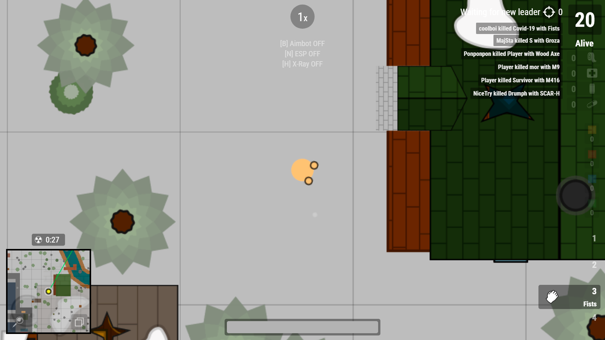
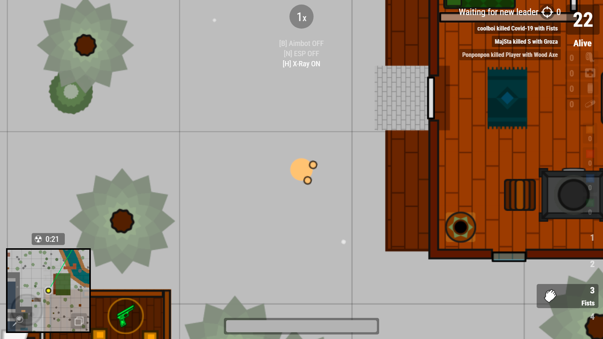

# survev-krityhack 🎯

Aimbot and ESP for surviv.io. Automatically targets the nearest player and displays lines connecting nearby players. Removes ceilings from buildings, allowing you to see inside them.

## Features ✨
- **X-Ray(No Ceilings)**: Removes ceilings from buildings, allowing you to see inside.

## Coming Soon 🚧
- **Aimbot**: Automatically targets the nearest player.
- **ESP (Extra Sensory Perception)**: Displays lines connecting nearby players.

## Installation 📥
1. Install the Tampermonkey extension for your browser from the [official website](https://www.tampermonkey.net/).
2. Download the latest script main.js.
3. Open Tampermonkey and click on the "Add a new script" button.
4. Copy and paste the downloaded script into the Tampermonkey editor.
5. Save the script and ensure it is enabled.
6. Refresh the survev.io page to activate the hack.

## Usage 🚀
1. Launch survev.io in your browser.
2. Run the hack executable.
3. Enjoy the enhanced gameplay!

## Disclaimer ⚠️
This software is for educational purposes only. Use at your own risk.

## Acknowledgements 🙏
Special thanks to zertalious for the [surviv.io Aimbot, ESP, X-Ray script](https://greasyfork.org/en/scripts/439241-surviv-io-aimbot-esp-x-ray) and his article on [how the Shellshock.io cheat was made](https://www.zertalious.xyz/how-was-the-shellshock-io-cheat-made/).

## License 📄
This project is licensed under the MIT License - see the [LICENSE](LICENSE) file for details.
